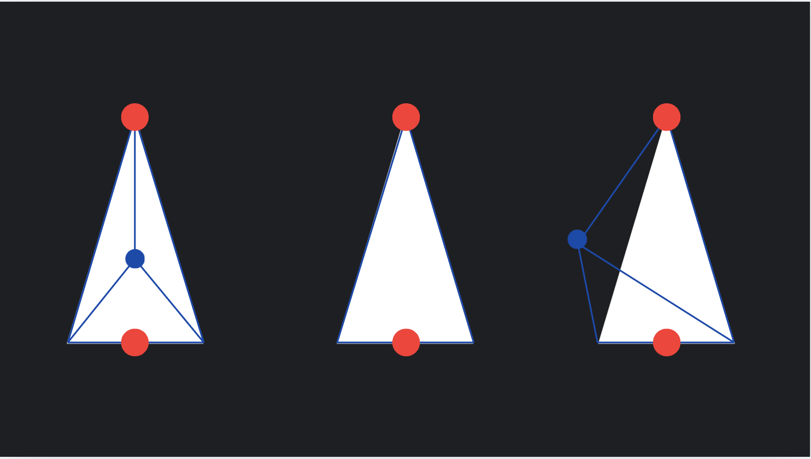
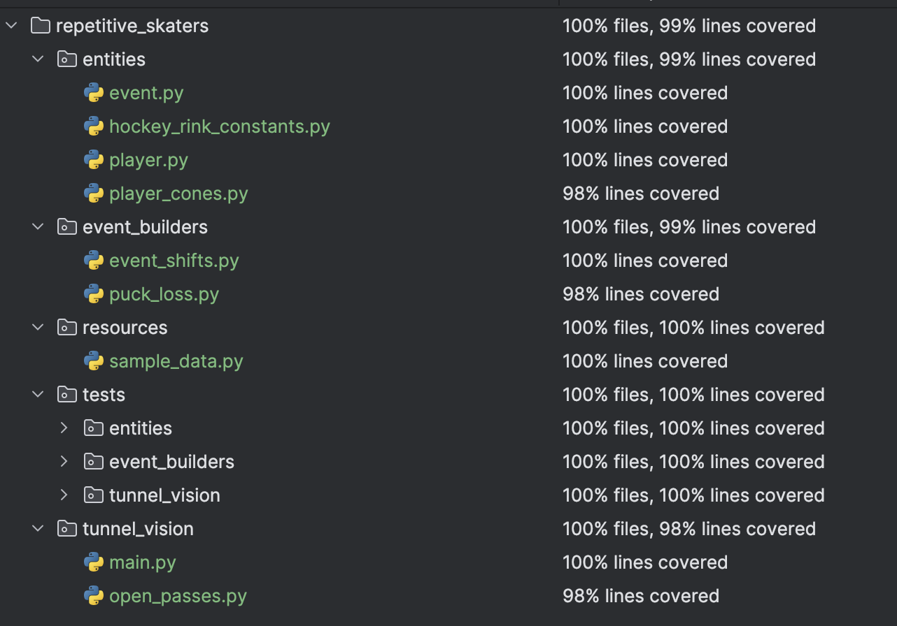
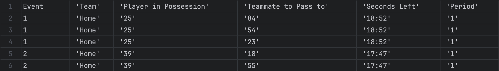

# **Missed Shots**
#### by: Matthew Dahlgren

**1** [Finding Missed Shots:](#game-modes-and-features)
- [Features](#features)
- [Post-Game Report](#post-game-report)

**2** [Requirements:](#requirements)

**3** [Explanation of Classes](#explanation-of-classes)

**4** [Test Coverage](#test-coverage)

**5** [Sample Output Data](#sample-output-data)

**6** [Resource Credits](#resource-credits)

## Game Modes and Features
### Features
- Parses Hockey Game Data and finds possible open passes a player could have made to teammates before having lost
possession of the puck to the opposite team.
- Writes a csv file containing this data to aid the user's review of a hockey game.

### Post-Game Report

The output report produced by this program contains the period, clock time, and players in possession and open for
passing to for coaches or players to review whether the players on their team or their opposing team are prone to not 
noticing open passes. The event type in a hockey game that this program tracks is when a player loses possession of the
puck to the opposing team, and checks the duration of the time of possession of that player to see if they had open
passes to teammates.

## Requirements
- Run with Python 3.11.5. Built and Tested with macOS.
- numPy: https://numpy.org/.
- Run [main.py](./tunnel_vision/main.py)

## Explanation of Classes
[Player](./entities/player.py) collects the times that this player is on the ice during an event (more on this later).
This class is tasked on concatenating important information for later comparison when verifying if a player was on the 
ice at a certain time, finding locations at a time and its successive time in the event for making areas of space
(later introduced as player_cones) to verify if they have rivalling players or nets between them and their teammates.

An [Event](./entities/event.py) is another class used to hold data to later be used when building our csv file. Events
contain the players that are on the ice during said event, the player in possession of the puck (that eventually loses
it) and the team said player was on. The event number on the output csv file refers to this exact event, each are
numbered to help users separate instances of a takeaway (losing the puck to the other team), in case the same player 
loses the puck back-to-back in a game.

A [Player Cone](./entities/player_cones.py) is a triangular area (isosceles) in shape with the centre vertex being made 
at the current location of the player that will eventually lose the puck and the centre of its base being the 
coordinates of teammates (after a second of play), with a width chosen by the user. The second of play allows for the 
reasoning that a player cannot simply immediately pass to a teammate. The functionality of a player cone is to verify if
there are any opposing players or nets within the area. This is done by finding the area of the original triangle. Then 
we take the three triangle formed by each subset of two vertices alongside the coordinates of the players on the other 
or the nets. If the sum of the area of these three triangles is equal to the original area of the triangle made between
the two players, the player or net is within this cone, and a pass would not be advised to make. A visual representation 
is attached below. 

From left to right this example shows: an obstruction (blue dot) within the cone between the two players on the same
team (red dots), a player cone with no obstructions being compared to it, and a player cone with an obstruction outside
of the player cone.

## Test Coverage
Below is the test coverage for the program. 

The tests implemented in this project mainly focuses on end-to-end testing with sample data found in 
resources/sample_data.py. 99% of lines are covered in the testing, the lines that are not getting tested are 
predominantly relating to cases where the csv file taken from online does not properly get reached by the program.

The assumptions being made upon use of this program and the functions, and entities are that the input files are 
reachable and public files online.

## Sample Output Data

From using the sample data for Team G at Team H found in resources/sample_data.py 

This output data shows two takeaway events (instances where players lost the puck to the other team), and for the
seconds leading up to the takeaway, the players who they had an uninterrupted pass to on their team.

## Resource Credits
[Sample Data](./resources/sample_data.py) was pulled from the resources at -
https://github.com/bigdatacup/Big-Data-Cup-2025
